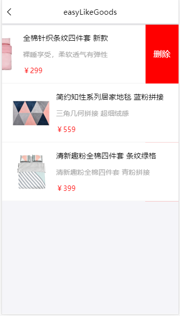

# EasyMarket [易购](https://github.com/Peroluo/easyMarketApp)

> ​EasyMarket 是仿网易严选 UI 设计的 H5 webApp。项目是基于 React+Redux+mobx+Axios+React-router。
> ​EasyMarket 采用阿里 antd-design-mobile 的 UI 组件。

## EasyMarket Screenshots

|         首页         |        制造商         |         商品分类         |         收藏商品         |
| :------------------: | :-------------------: | :----------------------: | :----------------------: |
|  |  |  |  |
 首页的很多详情与分类的一样所以只需要写一成组件就可以 后台会根据传参来渲染不同的内容
|         专题          |          专题详情           |            分类检索            |          商品查询           |
| :-------------------: | :-------------------------: | :----------------------------: | :-------------------------: |
|  |  |  |  |
 
  
|        购物车        |          商品详情           |        更多评论         |         我的         |
| :------------------: | :-------------------------: | :---------------------: | :------------------: |
|  |  |  |  |

## EasyMarket Preview

<figure class="third">
    
</figure>

## EasyMrket  计算rem
    

## EasyMrket 本地部署

> 1. git clone git@github.com:zhangmengxia618/wangyi.git
> 2. 安装依赖 cnpm install
> 3. 修改 package.json 文件中 proxy 字段的值 = 你本地服务器的 ip 地址 （"proxy": "http://127.0.0.1:8888"）
> 4. npm start

## EasyMarket 目前未完成功能

> - 登录功能需要完善

> - 购物车

> - 模糊搜索

> - 我的

> - 内容按需加载

## End

> - 会努力做到更好

## About Me

> Name: 一月不站小分队
>
>
> Email：18534139580@163.com
